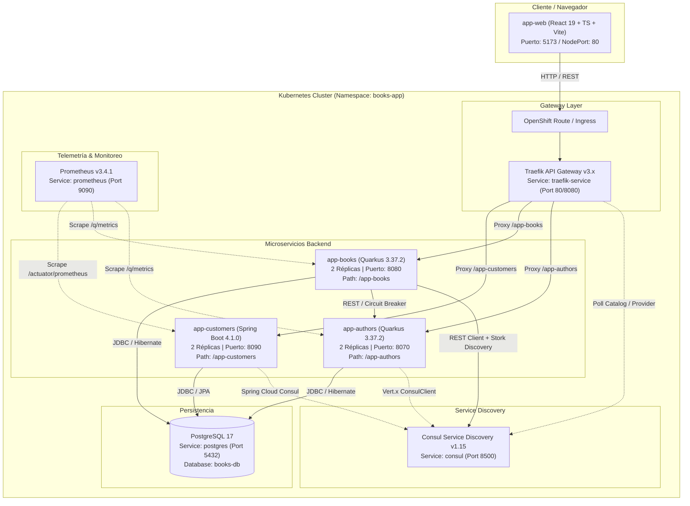

# Aplicación Books — Tarea Grupal

A continuación, el Grupo 6 presenta un proyecto multi-módulo que implementa una arquitectura basada en microservicios y un SPA Web para la gestión de Autores, Libros y Clientes. Se incluyen archivos de despliegue para Kubernetes con Service Discovery, Resiliencia y Telemetría.

---

## 1. Integrantes

| Nombre Completo | Cédula |
|---|---|
| Cristian Alexander Lechon Lechon | 1726696063 |
| Angelo Fabricio Pujota Pineda | 1726616541 |
| Edgar Vinicio Tipán López | 1727326421 |

---

## 2. Arquitectura de la Aplicación

El proyecto está conformado por 4 módulos principales (`app-authors`, `app-books`, `app-customers` y `app-web`), respaldados por PostgreSQL, Consul como Service Registry, Traefik como API Gateway, y Prometheus para monitoreo.



---

## 3. Tabla de Endpoints

### 3.1 `app-authors` (Quarkus — Puerto local: 8070)

| Método | Ruta | Código OK | Descripción |
|---|---|---|---|
| `GET` | `/authors` | `200 OK` | Listar todos los autores |
| `GET` | `/authors/{id}` | `200 OK` / `404 Not Found` | Obtener autor por ID (incluye puerto del servidor) |
| `GET` | `/authors/find/{isbn}` | `200 OK` | Obtener autores de un libro por ISBN |
| `POST` | `/authors` | `201 Created` | Crear un nuevo autor |
| `PUT` | `/authors/{id}` | `200 OK` / `404 Not Found` | Actualizar información de un autor |
| `DELETE` | `/authors/{id}` | `204 No Content` / `404 Not Found` | Eliminar un autor |

---

### 3.2 `app-books` (Quarkus — Puerto local: 8080)

| Método | Ruta | Código OK | Descripción |
|---|---|---|---|
| `GET` | `/books` | `200 OK` | Listar todos los libros con inventario y lista de autores |
| `GET` | `/books/{isbn}` | `200 OK` / `404 Not Found` | Buscar libro por ISBN con detalles completos |
| `POST` | `/books` | `201 Created` | Registrar un libro (retorna encabezado `Location`) |
| `PUT` | `/books/{isbn}` | `200 OK` / `404 Not Found` | Actualizar datos del libro |
| `DELETE` | `/books/{isbn}` | `204 No Content` / `404 Not Found` | Eliminar un libro |

---

### 3.3 `app-customers` (Spring Boot — Puerto local: 8090)

| Método | Ruta | Código OK | Descripción |
|---|---|---|---|
| `GET` | `/customers` | `200 OK` | Listar todos los clientes |
| `GET` | `/customers?email={email}` | `200 OK` | Filtrar cliente por correo electrónico |
| `GET` | `/customers/{id}` | `200 OK` / `404 Not Found` | Obtener cliente por ID |
| `POST` | `/customers` | `201 Created` / `400 Bad Request` | Crear cliente (valida email único) |
| `PUT` | `/customers/{id}` | `200 OK` / `404 Not Found` | Actualizar datos del cliente |
| `DELETE` | `/customers/{id}` | `204 No Content` / `404 Not Found` | Eliminar un cliente |
| `GET` | `/ping` | `200 OK` | Endpoint de verificación que responde `"pong"` (No reemplaza a los Health Checks) |

---

## 4. Health Checks

| Servicio | Framework | Ruta Liveness | Ruta Readiness | Framework de Health |
|---|---|---|---|---|
| `app-authors` | Quarkus 3.37.2 | `/q/health/live` | `/q/health/ready` | MicroProfile Health |
| `app-books` | Quarkus 3.37.2 | `/q/health/live` | `/q/health/ready` | MicroProfile Health |
| `app-customers` | Spring Boot 4.1.0 | `/actuator/health/liveness` | `/actuator/health/readiness` | Spring Boot Actuator |

---

## 5. Instrucciones de Ejecución

### 5.1 Ejecución Local con Docker Compose

```bash
# Navegar a la carpeta que contiene el archivo de despliegue docker-compose
cd deployment/docker-compose

# Iniciar todos los contenedores
docker-compose up -d

# Verificar estado de los servicios
docker-compose ps

# Detener los servicios
docker-compose down
```

---

### 5.2 Despliegue en Minikube (Kubernetes Local)

```bash
# 1. Iniciar Minikube
minikube start

# 2. Crear el namespace
kubectl apply -f deployment/k8s/namespace.yml

# 4. Crear ConfigMap y Secret
kubectl apply -f deployment/k8s/books-config.yml
kubectl apply -f deployment/k8s/books-secret.yml

# 5. Desplegar la infraestructura (PostgreSQL, Consul, Traefik)
kubectl apply -f deployment/k8s/postgresql-deployment.yml
kubectl apply -f deployment/k8s/consul-deployment.yml
kubectl apply -f deployment/k8s/traefik-deployment.yml

# 6. Desplegar los microservicios backend y frontend
kubectl apply -f deployment/k8s/app-authors-deployment.yml
kubectl apply -f deployment/k8s/app-books-deployment.yml
kubectl apply -f deployment/k8s/app-customers-deployment.yml
kubectl apply -f deployment/k8s/app-web-deployment.yml

# 7. Desplegar Monitoreo (Prometheus)
kubectl apply -f deployment/telemetria/prometheus-config.yml
kubectl apply -f deployment/telemetria/prometheus-deployment.yml

# 8. Verificar estado de los Pods y Servicios
kubectl get pods -n books-app
kubectl get svc -n books-app

# 9. Obtener URL de acceso al frontend o a Traefik Gateway
minikube service traefik-service -n books-app --url
```

---

### 5.3 Despliegue en OpenShift Developer Sandbox

```bash
# Esta guía toma en cuenta que ya existe una sesión iniciada y activa de oc
# No se incluirá el comando para crear el proyecto/namespace dado que la cuenta activa
# que poseemos en OpenShift no nos permite crear ningun proyecto nuevo.

# 1. Configuraciones y secretos
oc apply -f k8s/books-config.yaml
oc apply -f k8s/books-secret.yaml

# 2. Levantar toda la telemetría de golpe
oc apply -f telemetria/

# 3. Levantar el resto de la carpeta k8s
# (OpenShift reiniciará cualquier pod que se haya iniciado antes de tiempo)
oc apply -f k8s/
```

---

## 6. Verificación con `curl`

### 6.1 `app-authors`

```bash
# Listar todos los autores
curl -i -X GET http://localhost:8070/authors

# Obtener autor por ID
curl -i -X GET http://localhost:8070/authors/1

# Buscar autores por ISBN
curl -i -X GET http://localhost:8070/authors/find/978-0134685991

# Crear nuevo autor
curl -i -X POST http://localhost:8070/authors \
  -H "Content-Type: application/json" \
  -d '{"name": "Gabriel García Márquez", "version": 1}'

# Actualizar autor
curl -i -X PUT http://localhost:8070/authors/1 \
  -H "Content-Type: application/json" \
  -d '{"name": "Robert C. Martin (Updated)", "version": 2}'

# Eliminar autor
curl -i -X DELETE http://localhost:8070/authors/1
```

---

### 6.2 `app-books`

```bash
# Listar todos los libros
curl -i -X GET http://localhost:8080/books

# Buscar libro por ISBN
curl -i -X GET http://localhost:8080/books/978-0134685991

# Crear nuevo libro
curl -i -X POST http://localhost:8080/books \
  -H "Content-Type: application/json" \
  -d '{"isbn": "978-0321356680", "title": "Effective Java", "price": 45.00}'

# Actualizar libro
curl -i -X PUT http://localhost:8080/books/978-0321356680 \
  -H "Content-Type: application/json" \
  -d '{"isbn": "978-0321356680", "title": "Effective Java 3rd Edition", "price": 49.99}'

# Eliminar libro
curl -i -X DELETE http://localhost:8080/books/978-0321356680
```

---

### 6.3 `app-customers`

```bash
# Listar clientes
curl -i -X GET http://localhost:8090/customers

# Filtrar por email
curl -i -X GET "http://localhost:8090/customers?email=john.doe@example.com"

# Buscar por ID
curl -i -X GET http://localhost:8090/customers/1

# Crear cliente
curl -i -X POST http://localhost:8090/customers \
  -H "Content-Type: application/json" \
  -d '{"firstName": "Carlos", "lastName": "Pérez", "email": "carlos.perez@example.com", "phone": "0991234567", "address": "Quito, Ecuador"}'

# Intentar crear cliente con email duplicado (retorna 400 Bad Request)
curl -i -X POST http://localhost:8090/customers \
  -H "Content-Type: application/json" \
  -d '{"firstName": "Carlos", "lastName": "Pérez", "email": "carlos.perez@example.com"}'

# Actualizar cliente
curl -i -X PUT http://localhost:8090/customers/1 \
  -H "Content-Type: application/json" \
  -d '{"firstName": "John", "lastName": "Doe Updated", "email": "john.doe@example.com", "phone": "0998765432", "address": "Guayaquil"}'

# Eliminar cliente
curl -i -X DELETE http://localhost:8090/customers/1

# Health Check Actuator
curl -i -X GET http://localhost:8090/actuator/health

# Endpoint Ping (Por petición de la rúbrica, no reemplaza el Health Check)
curl -i -X GET http://localhost:8090/ping
```

---

## 7. Resiliencia — Circuit Breaker

### Comportamiento Implementado
En el microservicio `app-books`, la consulta hacia `app-authors` para resolver los autores de un libro utiliza SmallRye Fault Tolerance con las siguientes políticas:
- **`@CircuitBreaker`**: Umbral de fallos = 3 (`requestVolumeThreshold = 3`), tiempo de reapertura = 5 segundos (`delay = 5000ms`).
- **`@Retry`**: Máximo 3 reintentos con retraso de 1 segundo entre cada intento.
- **`@Fallback`**: Retorna una lista vacía de autores si el servicio `app-authors` se encuentra no disponible o con el circuito abierto.
- **Health Check Integrado**: El health check `AuthorsServiceHealthCheck` en `app-books` monitorea el estado del circuito. Si el circuito pasa al estado **OPEN**, el health check `/q/health/ready` de `app-books` reporta el estado **DOWN**.

### Guía de Prueba del Circuit Breaker

1. **Escenario Normal (Circuito CLOSED)**:
   - Realizar una petición `GET http://localhost:8080/books`.
   - La respuesta incluirá la lista de libros con sus autores correspondientes.
   - `/q/health/ready` de `app-books` responde `UP`.

2. **Simulación de Fallo (Detener `app-authors`)**:
   ```bash
   # En docker-compose o Kubernetes:
   docker-compose stop app-authors
   # O en Kubernetes:
   kubectl scale deployment app-authors-deployment --replicas=0
   ```

3. **Verificación de Fallback**:
   - Realizar de nuevo `GET http://localhost:8080/books`.
   - Se activarán los reintentos (`@Retry`) y posteriormente el circuito se abrirá (`@CircuitBreaker`).
   - La petición devolverá código `200 OK`, pero la lista de autores en cada libro vendrá vacía `[]` (comportamiento del `@Fallback`).

4. **Verificación de Health Check DOWN**:
   - Consultar el endpoint de readiness de `app-books`:
     ```bash
     curl -i http://localhost:8080/q/health/ready
     ```
   - El reporte indicará `"status": "DOWN"` debido a la apertura del circuito hacia `authors-api`.

5. **Restablecimiento**:
   - Volver a iniciar `app-authors` (`docker-compose start app-authors` o `kubectl scale deployment app-authors-deployment --replicas=2`).
   - Tras 5 segundos, el circuito pasará a **HALF-OPEN** y posteriormente a **CLOSED**, recuperando el estado `UP`.

---

## 8. Monitoreo con Prometheus

### Acceso a Prometheus
- **Local (Docker / K8s Port-Forward)**: `http://localhost:9090`
- En Kubernetes se despliega mediante los manifiestos en `deployment/telemetria/`.

### Configuración de Scraping
Prometheus realiza scraping a los siguientes objetivos definidos en `prometheus-config.yml`:
- `app-authors`: `http://app-authors:8070/q/metrics`
- `app-books`: `http://app-books:8080/q/metrics`
- `app-customers`: `http://app-customers:8090/actuator/prometheus`

### Consultas PromQL de Ejemplo

1. **Estado de salud de las instancias monitoreadas (Targets)**:
   ```promql
   up
   ```

2. **Tasa de peticiones HTTP en Quarkus (`app-authors` y `app-books`)**:
   ```promql
   rate(http_requests_total[5m])
   ```

3. **Métricas HTTP en Spring Boot (`app-customers`)**:
   ```promql
   http_server_requests_seconds_count
   ```

4. **Uso de memoria JVM Heap**:
   ```promql
   jvm_memory_used_bytes{area="heap"}
   ```

---

## 9. Capturas de Pantalla

> *Nota: Adjuntar las imágenes correspondientes en la carpeta `docs/screenshots/` o sustituir las referencias a continuación.*

1. **Consul Service Discovery Dashboard** (Servicios `app-authors`, `app-books`, `app-customers` registrados):
   

2. **Frontend React (`app-web`)** (Página principal con métricas y tablas CRUD):
   

3. **Traefik API Gateway Dashboard**:
   

4. **Prometheus Targets** (Todos los servicios backend en estado UP):
   

5. **Health Check Quarkus (`app-authors` / `app-books`)**:
   

6. **Health Check Spring Boot Actuator (`app-customers`)**:
   

---

## 10. Decisiones de Diseño

### 10.1 Frontend (`app-web`)
- **React 19 + TypeScript**: Se utilizó React 19 junto con TypeScript en modo estricto para garantizar tipado seguro en los contratos DTO de las tres entidades (`Author`, `Book`, `Customer`).
- **Zustand para Estado Global**: Se seleccionó Zustand por ser una alternativa ligera, limpia y con menos boilerplate que Redux Toolkit. Permite un manejo intuitivo de estados asíncronos (`loading`, `error`) y sincronización centralizada.
- **CSS Modules + Variables CSS**: Se adoptaron CSS Modules para asegurar la encapsulación de estilos por componente, combinados con variables CSS globales en `index.css` para mantener una paleta estética moderna (Dark Theme, Glassmorphism).
- **Vistas de Detalle Dedicadas**: Se implementó navegación declarativa con `react-router-dom v7` especificando subrutas de detalle (`/authors/:id`, `/books/:isbn`, `/customers/:id`) accesibles mediante la interfaz.

### 10.2 Backend Quarkus (`app-authors`, `app-books`)
- **Panache ORM**: Facilita la implementación del patrón Repository (`PanacheRepositoryBase`) reduciendo código repetitivo para operaciones CRUD y consultas custom (`findByBook`).
- **SmallRye Stork + Consul**: Permite resolución dinámica de nombres de servicio y balanceo de carga.
- **SmallRye Fault Tolerance**: Implementación del patrón Circuit Breaker con Fallback en la comunicación inter-servicio para evitar fallos en cascada.

### 10.3 Backend Spring Boot (`app-customers`)
- **Spring Cloud Consul Discovery**: Integración nativa con Consul para auto-registro al iniciar la aplicación.
- **Spring Boot Actuator + Micrometer**: Exposición normalizada de endpoints de salud y telemetría en formato OTLP.
- **Manejo Centralizado de Excepciones**: Implementación de `@RestControllerAdvice` con `GlobalExceptionHandler` para transformar excepciones del dominio (ej. `EmailException` por email duplicado) en respuestas de error `400 Bad Request`.
